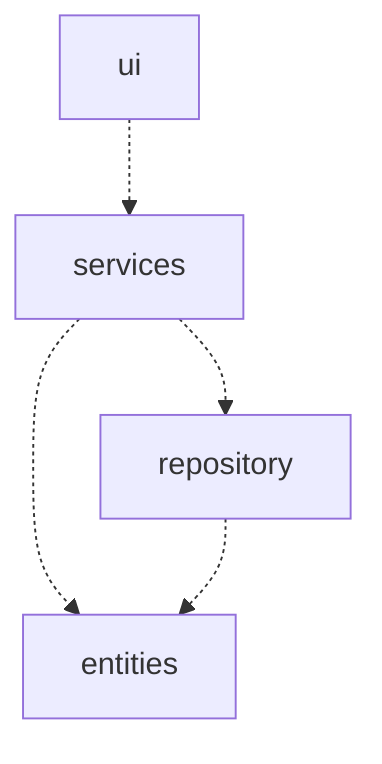
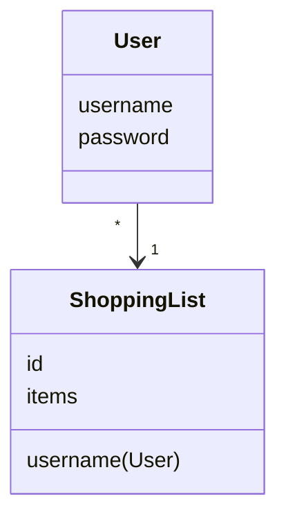
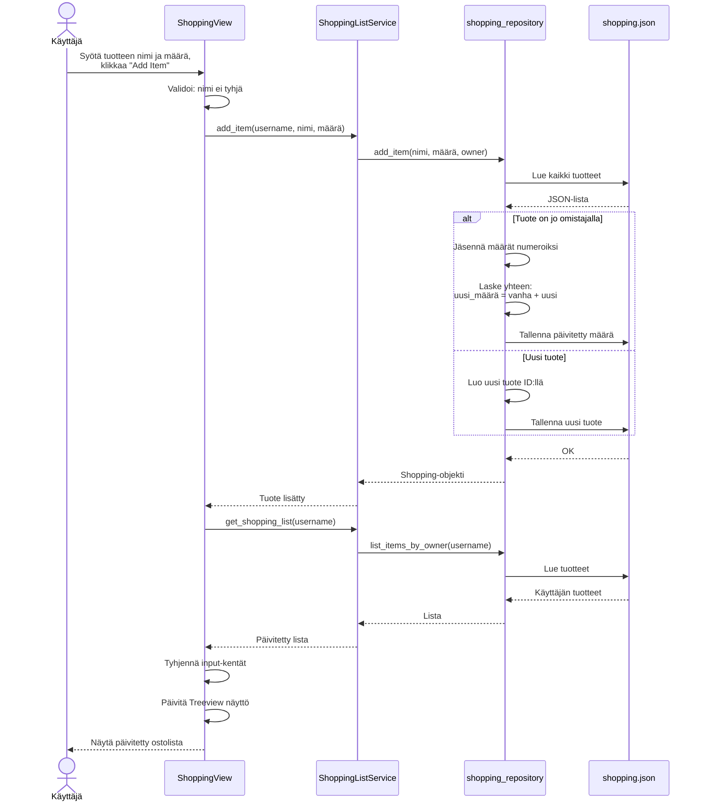

# Arkkitehtuurikuvaus

## Rakenne

Ohjelman rakenne noudattaa kolmitasoista kerrosarkkitehtuuria, ja koodin pakkausrakenne on seuraava:



Pakkaus _ui_ sisältää käyttöliittymästä, _services_ sovelluslogiikasta ja _repository_ tietojen pysyväistallennuksesta vastaavan koodin. Pakkaus _entities_ sisältää luokkia, jotka kuvastavat sovelluksen käyttämiä tietokohteita.

## Käyttöliittymä

Käyttöliittymä sisältää kolme erillistä näkymää:

- Kirjautuminen
- Uuden käyttäjän luominen
- Ostoslista

Jokainen näistä on toteutettu omana luokkanaan. Näkymistä yksi on aina kerrallaan näkyvänä. Näkymien näyttämisestä vastaa [UI](../src/ui/ui.py)-luokka. Käyttöliittymä on pyritty eristämään sovelluslogiikasta.

## Sovelluslogiikka

Sovelluksen loogisen tietomallin muodostavat luokat [User](../src/entities/user.py) ja ShoppingList, jotka kuvaavat käyttäjiä ja ostoslistoja:



Toiminnallisista kokonaisuuksista vastaa luokka [ShoppingListService](../src/services/shopping_list_service.py). Luokka tarjoaa käyttöliittymän toiminnoille metodit ostoslistan hallintaan.

Sovelluslogiikka pääsee käsiksi käyttäjiin tietojen tallennuksesta vastaavan luokan [UserRepository](../src/repository/user_repository.py) kautta.


## Tietojen pysyväistallennus

Pakkauksen _repository_ luokka `UserRepository` huolehtii käyttäjätietojen tallettamisesta.

### Tiedostot

Sovellus tallettaa käyttäjien tiedot JSON-tiedostoon.

Käyttäjät tallennetaan JSON-taulukkoon seuraavassa formaatissa:

```json
[
    {
        "username": "matti",
        "password": "salasana123"
    }
]
```


## Päätoiminnallisuudet 
 

    ämä sekvenssikaavio kuvaa prosessia, kun käyttäjä lisää tuotteen ostoslistaan. Sovellus aggregoi määrät automaattisesti, jos tuote on jo listalla.

