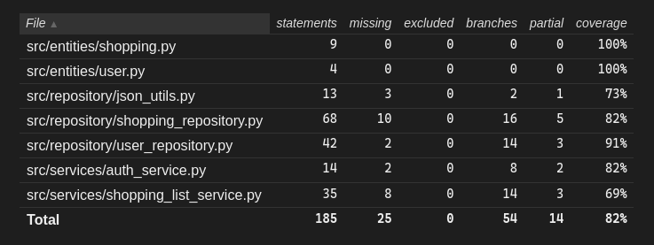

# Testausohjeet - ShoppingListApp

## Yleiskuvaus

Tavoite: varmistaa, että sovelluksen keskeiset toiminnot toimivat odotetusti (rekisteröinti, kirjautuminen, ostoslistan muokkaus, listan jakaminen leikepöydälle ja uloskirjautuminen) sekä että tallennus JSON-tiedostoihin toimii.

Komentot (projekti-hakemistosta):

```bash
poetry install  
poetry run invoke test
poetry run invoke coverage-report
```

## Automaattiset testit

Sovelluksessa on yksikkö- ja integraatiotestejä, jotka kattavat pääosin services- ja repository-kerrokset. Automatisoidut testit ajetaan komennolla:

```bash
poetry run invoke test
```

Nykyinen testikattavuus (UI-kerros poislukien) on korkea; testit kattavat mm.:

- Käyttäjän rekisteröinnin ja validoinnin
- Kirjautumisen validoinnin
- Ostoslistan lisäyksen
- Ostoslistan poiston ja tyhjennyksen


## Testauskattavuus ja poikkeukset

Käyttöliittymäkerrosta lukuunottamatta sovelluksen testauksen haarautumakattavuus on korkea.



Testaamatta jäi esim. copy to clipboard ja uloskirjautuminen.

## Järjestelmätestaus

Sovelluksen toiminnallisuuksia on lisäksi validoitu järjestelmätestein manuaalisesti. Testit on käyty läpi eri käyttöjärjestelmäympäristöissä  Linuxilla ja Windowsilla.

Testauksessa huomioitiin sekä tilanteet, joissa data-tiedostot (`data/users.json`, `data/shopping.json`) olivat valmiina, että tilanteet joissa ne puuttuivat sovellus luo puuttuvat tiedostot käynnistyksen yhteydessä.

Manuaalisesti varmistetut toiminnallisuudet sisältävät muun muassa:

- Ostoslistan kopiointi leikepöydälle ja liittämisen varmistaminen tekstieditoriin
- Uloskirjautumisen toiminta ja näkymien vaihtuminen

## Havaitut laatu- ja kehityskohteet

- Parannettava ja yhtenäistettävä virheilmoituksia esim. käyttäjä pystyi aiemmin lisätä tuotteita negatiivisella arvolla.