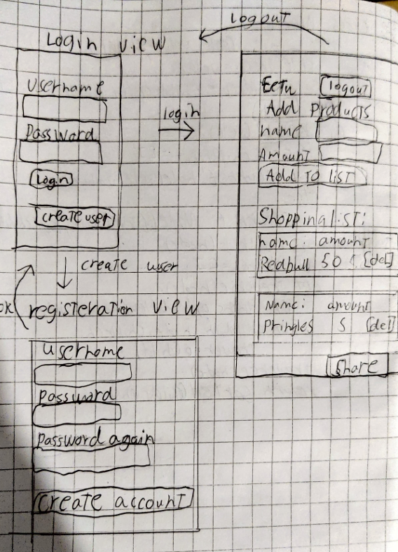

# Vaatimuusmäärittely

## Sovelluksen Tarkoitus

Sovelluksella käyttäjä voi luoda oman ostoslistan ja jakaa sen helposti kopioimalla leikepöydälle, josta sen voi liittää esimerkiksi WhatsAppiin puolisolelle. Sovellukseen on mahdollista rekisteröityä useampi käyttäjä. Jokaisella käyttäjällä on oma ostoslista jonka voi jakaa kelle haluaa.

## Käyttäjät
- Tavallinen käyttäjä: Voi luoda oman käyttäjätilin, hallita omaa ostoslistaansa ja jakaa sen muille
- Sovelluksessa on vain yksi käyttäjärooli, joten ei ole erillistä pääkäyttäjää tai ylläpitäjää

## Käyttöliittymäluonnos
Käyttöliittymässä on kolme erinlaista näkymää, login näkymä, registeration näkymä ja ns main näkymä

- Login-näkymä: Kirjautumislomake käyttäjätunnuksella ja salasanalla, linkki rekisteröitymisnäkymään
- Registration-näkymä: Rekisteröitymislomake uuden käyttäjän luomiseen, linkki takaisin kirjautumisnäkymään
- Main-näkymä: Pääkäyttönäkymä, jossa näkyy käyttäjän ostoslista, mahdollisuus lisätä/poistaa tuotteita ja kopioida lista leikepöydälle

## Toiminnalisuus

### Ennen kirjautumista
* Käyttäjä voi luoda uuden käyttäjätilin (tehty)
  - Käyttäjätunnuksen tulee olla uniikki ja vähintään 3 merkkiä pitkä (tehty)
  - Salasanan tulee olla vähintään 8 merkkiä pitkä ja sisältää 1 erikoismerkin (tehty)
  - Jos rekisteröinti onnistuu, käyttäjä menee login näkymään (tehty)
* Käyttäjä voi kirjautua sisään järjestelmään (tehty)
  - Kirjautuminen onnistuu oikeilla tunnuksilla (tehty)
  - Järjestelmä ilmoittaa virheellisistä kirjautumistiedoista (tehty)

### Kirjautumisen jälkeen
* Käyttäjä näkee oman ostoslistansa
* Käyttäjä voi lisätä uusia tuotteita ostoslistalleen
  - Tuotteelle voidaan antaa nimi ja määrä (molemmat täytyy antaa)
* Käyttäjä voi poistaa ne listalta
* Käyttäjä voi kopioida ostoslistan leikepöydälle
  - Lista muotoillaan tekstimuotoon jakamista varten
* Käyttäjä voi kirjautua ulos järjestelmästä

## Jatkokehitysideoita
- Tuotekategoriat ostoslistan järjestämiseksi
- Yhteistyölliset ostoslistat, joita useat käyttäjät voivat muokata yhdessä reaaliajassa
- Suosikki-tuotteet, jotka voi lisätä nopeasti listalle
- Tuotehistoria näkymä
- SQLite3-tietokannan siirtäminen parempaan tietokantahallintaan
- Mahdollisuus jakaa lista sovelluksiin (whatsapp, Telegram)